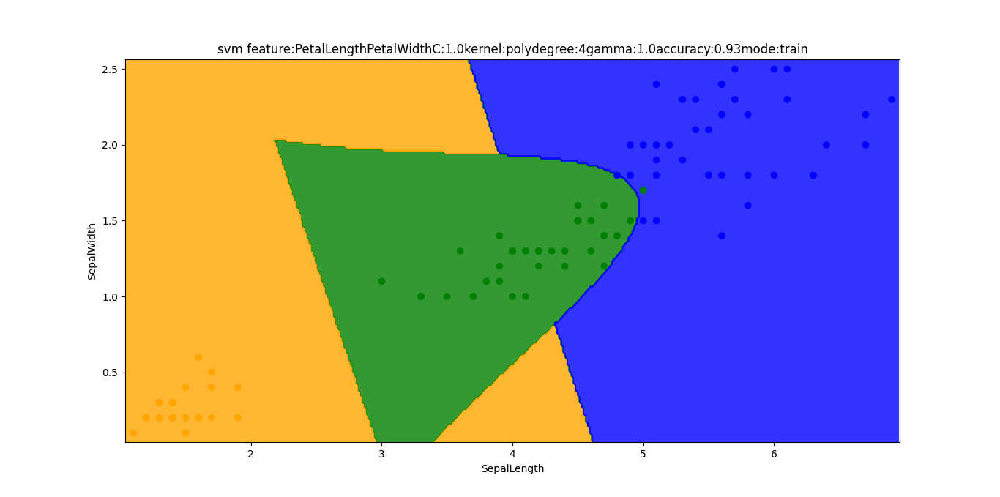
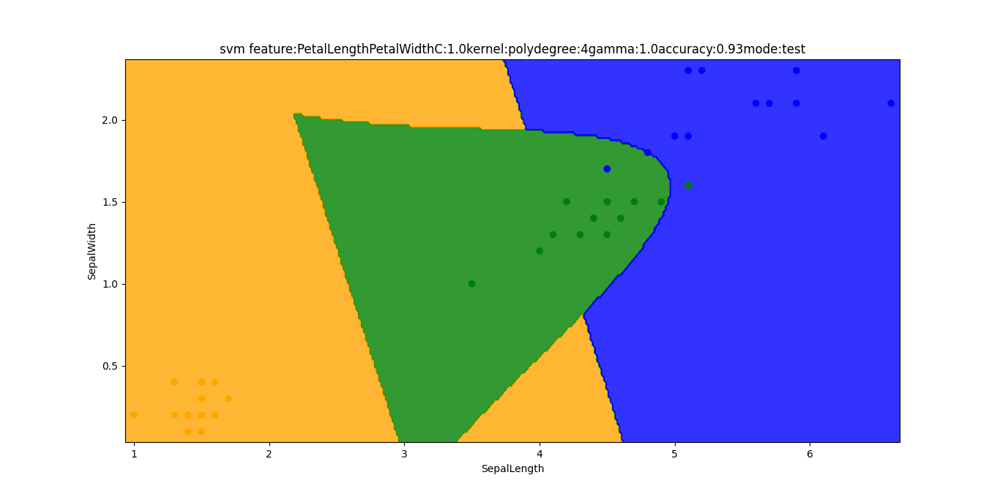
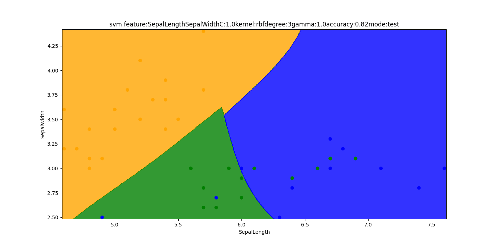
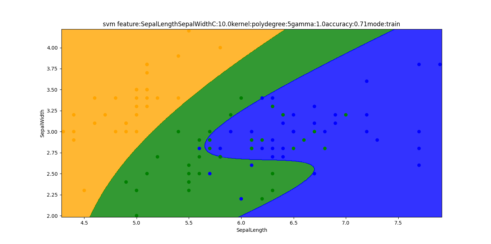
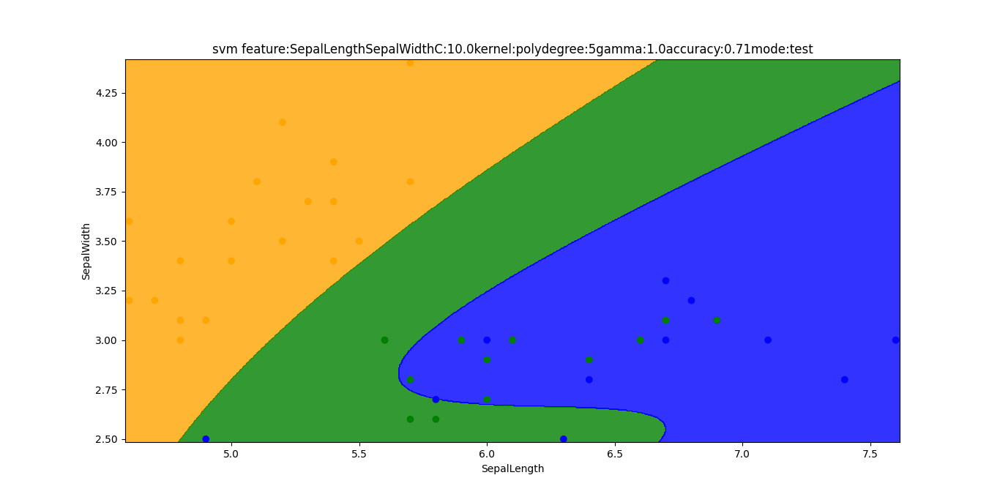

# Directory Structure
```text
.
├── data
│   └── iris_data.csv
├── figures
│   ├── Figure_cm_feature:PetalLengthPetalWidthC:10.0kernel:polydegree:5gamma:1.0accuracy:0.93.png
│   ├── Figure_cm_feature:PetalLengthPetalWidthC:1.0kernel:polydegree:4gamma:1.0accuracy:0.93.png
│   ├── Figure_cm_feature:PetalLengthPetalWidthC:1.0kernel:rbfdegree:3gamma:1.0accuracy:0.96.png
│   ├── Figure_cm_feature:SepalLengthSepalWidthC:10.0kernel:polydegree:5gamma:1.0accuracy:0.71.png
│   ├── Figure_cm_feature:SepalLengthSepalWidthC:1.0kernel:polydegree:4gamma:1.0accuracy:0.80.png
│   ├── Figure_cm_feature:SepalLengthSepalWidthC:1.0kernel:rbfdegree:3gamma:1.0accuracy:0.82.png
│   ├── Figure_preds_feature:PetalLengthPetalWidthC:10.0kernel:polydegree:5gamma:1.0accuracy:0.93mode:test.png
│   ├── Figure_preds_feature:PetalLengthPetalWidthC:10.0kernel:polydegree:5gamma:1.0accuracy:0.93mode:train.png
│   ├── Figure_preds_feature:PetalLengthPetalWidthC:1.0kernel:polydegree:4gamma:1.0accuracy:0.93mode:test.png
│   ├── Figure_preds_feature:PetalLengthPetalWidthC:1.0kernel:polydegree:4gamma:1.0accuracy:0.93mode:train.png
│   ├── Figure_preds_feature:PetalLengthPetalWidthC:1.0kernel:rbfdegree:3gamma:1.0accuracy:0.96mode:test.png
│   ├── Figure_preds_feature:PetalLengthPetalWidthC:1.0kernel:rbfdegree:3gamma:1.0accuracy:0.96mode:train.png
│   ├── Figure_preds_feature:SepalLengthSepalWidthC:10.0kernel:polydegree:5gamma:1.0accuracy:0.71mode:test.png
│   ├── Figure_preds_feature:SepalLengthSepalWidthC:10.0kernel:polydegree:5gamma:1.0accuracy:0.71mode:train.png
│   ├── Figure_preds_feature:SepalLengthSepalWidthC:1.0kernel:polydegree:4gamma:1.0accuracy:0.80mode:test.png
│   ├── Figure_preds_feature:SepalLengthSepalWidthC:1.0kernel:polydegree:4gamma:1.0accuracy:0.80mode:train.png
│   ├── Figure_preds_feature:SepalLengthSepalWidthC:1.0kernel:rbfdegree:3gamma:1.0accuracy:0.82mode:test.png
│   └── Figure_preds_feature:SepalLengthSepalWidthC:1.0kernel:rbfdegree:3gamma:1.0accuracy:0.82mode:train.png
├── README.md
├── run.py
└── utils
    ├── config.py
    ├── data.py
    ├── __init__.py
    ├── model.py
    └── plot.py

3 directories, 26 files
```
# Command Line Interface
```text
usage: run.py [-h] {linear,rbf,poly} ...

positional arguments:
  {linear,rbf,poly}  which kernel we choose
    linear           linear kernel
    rbf              rbf kernel
    poly             kernel poly

optional arguments:
  -h, --help         show this help message and exit
```

# SVM parameters

```text
Kernel: linear, rbf, poly 
```
```text
Gamma: 0.1, 1, 10, 100
```
```text
C: 0.1, 1, 10, 100, 1000
```
```text
Degree: 2, 3, 4, 5, 6
```
## Train the SVC model with PetalLength, PetalWidth features

# Experiment 1

### Parameters
```text
kernel: poly
```
```text
gamma: 1
```
```text
C: 1
```
```text
degree: 4
```
### CLI
```shell
 python run.py poly --degree 4 --gamma 1 --C 1
 ```
### Confusion Matrix


### Accuracy Score: 0.93

### Prediction Boundary
#### for Train data

#### for Test data



# Experiment 2

### Parameters
```text
kernel: rbf
```
```text
gamma: 1
```
```text
C: 1
```
```text
degree: 3
```
### CLI
```shell
 python run.py rbf --degree 3 --gamma 1 --C 1
 ```
### Confusion Matrix


### Accuracy Score: 0.96

### Prediction Boundary
#### for Train data

#### for Test data


# Experiment 3


### Parameters
```text
kernel: poly
```
```text
gamma: 1
```
```text
C: 10
```
```text
degree: 5
```
### CLI
```shell
 python run.py poly --degree 5 --gamma 1 --C 10
 ```
### Confusion Matrix


### Accuracy Score: 0.93

### Prediction Boundary
#### for Train data

#### for Test data


## Train the SVC model with SepalLength, SepalWidth features

# Experiment 1

### Parameters
```text
kernel: poly
```
```text
gamma: 1
```
```text
C: 1
```
```text
degree: 4
```
### CLI
```shell
 python run.py poly --degree 4 --gamma 1 --C 1
 ```
### Confusion Matrix


### Accuracy Score: 0.80

### Prediction Boundary
#### for Train data

#### for Test data



# Experiment 2

### Parameters
```text
kernel: rbf
```
```text
gamma: 1
```
```text
C: 1
```
```text
degree: 3
```
### CLI
```shell
 python run.py rbf --degree 3 --gamma 1 --C 1
 ```
### Confusion Matrix


### Accuracy Score: 0.82

### Prediction Boundary
#### for Train data

#### for Test data


# Experiment 3


### Parameters
```text
kernel: poly
```
```text
gamma: 1
```
```text
C: 10
```
```text
degree: 5
```
### CLI
```shell
 python run.py poly --degree 5 --gamma 1 --C 10
 ```
### Confusion Matrix


### Accuracy Score: 0.71

### Prediction Boundary
#### for Train data

#### for Test data

